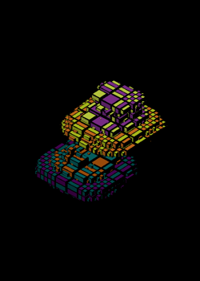

# Stretchy Blocks (2024)



An artistic animation of blocks that stretch and squish.
Made as a WebGPU learning project.

See it animated at https://ptrgags.dev/stretchy-blocks/

The web page linked above describes the animation in more
detail.

## Repo Usage

### Build the app

```sh
# TypeScript build
npm run build

# Copy static files (HTML, shaders, images) to dist/ folder.
# For such a small project, I didn't bother with a bundler.
npm run copy-static
```

### Deploy to GitHub pages

```sh
# Ensure everything is built
npm run build
npm run copy-static

# Check dist/ into git

# This pushes the results to the gh-pages branch in GitHub.
npm run deploy
```
